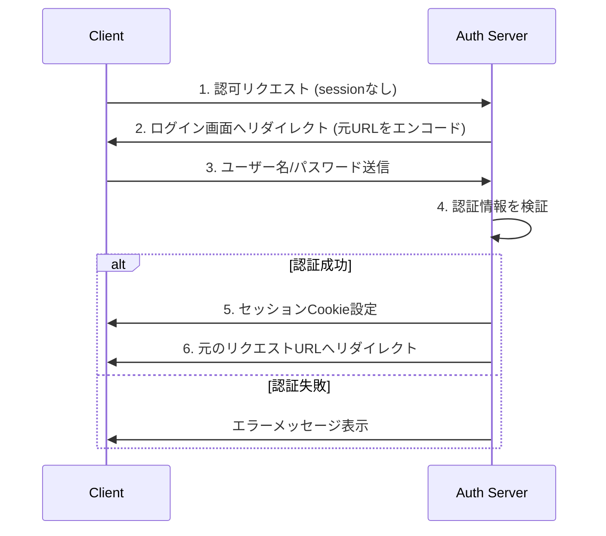
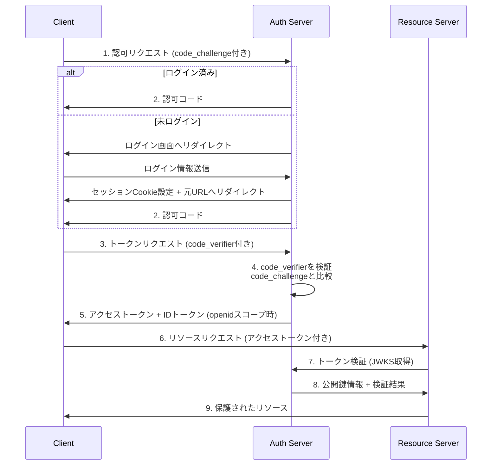
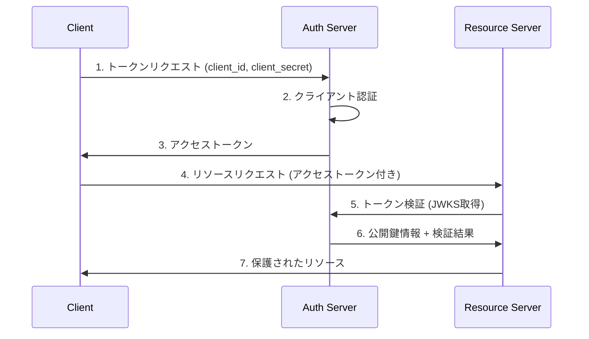

# OAuth と OpenID Connect を実装して理解する

- [OAuth 2.0 の認可サーバを自作してみたった](https://zenn.dev/hitoe_kami/articles/0050-articles-go-oauth2-server)
- [フルスクラッチして理解するOpenID Connect](https://www.m3tech.blog/entry/2024/03/05/150000)

## システム概要

このリポジトリでは、OAuth 2.0とOpenID Connectのフローを実装しています。主要なコンポーネントとして以下の3つがあります：

1. **クライアントアプリケーション (Client)**：ユーザーがアクセスするSPA
2. **認証サーバー (Auth Server)**：認証・認可を担当
3. **リソースサーバー (Resource Server)**：保護されたリソースを提供

### アーキテクチャ図

```mermaid
graph TD
    Client["Client<br/>(localhost:5173)"]
    AuthServer["Auth Server<br/>(localhost:3123)"]
    ResourceServer["Resource Server<br/>(localhost:6244)"]
    
    Client -->|1. 認可リクエスト| AuthServer
    AuthServer -->|2a. ログイン要求<br/>(未認証の場合)| Client
    Client -->|2b. ログイン情報送信| AuthServer
    AuthServer -->|3. 認可コード| Client
    Client -->|4. トークンリクエスト<br/>(code + code_verifier)| AuthServer
    AuthServer -->|5. アクセストークン<br/>(+ IDトークン)| Client
    Client -->|6. アクセストークンを<br/>使ったリソース要求| ResourceServer
    ResourceServer -->|7. トークン検証要求<br/>(JWKSやイントロスペクション)| AuthServer
    AuthServer -->|8. 検証結果| ResourceServer
    ResourceServer -->|9. 保護されたリソース| Client
```

### 実装されているフローの説明

#### 1. ログイン認証フロー

1. **ログイン要求の検出**：
   - ユーザーが保護されたリソースにアクセスまたは認可リクエストを行うとき、認証サーバーはセッションCookieを確認
   - セッションが存在しない場合、ユーザーをログインページ（`/login`）にリダイレクト
   - リダイレクト時、元のリクエストURLをパラメータとして（Base64エンコードされた形で）保持

2. **ログインフォームの表示**：
   - 認証サーバーは、ユーザー名とパスワードを入力するフォームを表示
   - フォームには元のリクエストURLがhidden inputとして含まれる

3. **認証情報の検証**：
   - ユーザーがフォームを送信すると、認証サーバーはユーザー名とパスワードを検証
   - 検証が成功すると、新しいセッションIDが生成され、Cookieとして設定
   - セッションデータ（ユーザーIDとユーザー名）がRedisに保存される

4. **元のリクエストへのリダイレクト**：
   - ログイン成功後、ユーザーは元のリクエストURLにリダイレクトされる
   - セッションCookieが設定されているため、以降のリクエストではログインチェックが通過

#### 2. 認可コードフロー (Authorization Code Flow) + PKCE

1. **クライアント登録**：
   - クライアントアプリケーションが認証サーバーに登録し、client_idとclient_secretを取得

2. **認可リクエスト**：
   - クライアントが認証サーバーの`/authorize`エンドポイントにリダイレクト
   - PKCE用のcode_verifierを生成し、そのハッシュ値（code_challenge）をパラメータとして送信
   - リクエストパラメータ: response_type=code, client_id, redirect_uri, state, code_challenge, code_challenge_method=S256

3. **ユーザー認証**：
   - 認証サーバーがユーザーにログイン状態を確認
   - ログインしていない場合、上記の「ログイン認証フロー」が実行される

4. **認可コード発行**：
   - 認証が成功すると、認証サーバーがクライアントのredirect_uriに認可コードをリダイレクト

5. **トークン交換**：
   - クライアントが認可コードと元のcode_verifierを使って`/token`エンドポイントにリクエスト
   - 認証サーバーがcode_verifierとcode_challengeを検証
   - 検証成功後、アクセストークン（JWTトークン）とスコープに「openid」が含まれる場合はIDトークンも発行

6. **リソースアクセス**：
   - クライアントはアクセストークンを使ってリソースサーバーの`/resource`エンドポイントにアクセス
   - リソースサーバーは認証サーバーの`/.well-known/jwks.json`エンドポイントから公開鍵を取得してトークンを検証
   - トークンが有効であれば保護されたリソースを返却

#### 2. クライアントクレデンシャルフロー (Client Credentials Flow)

1. **トークン取得**：
   - クライアントが自身のclient_idとclient_secretを使って直接`/token`エンドポイントにリクエスト
   - 認証サーバーがクライアント情報を検証
   - 検証成功後、アクセストークンを発行（この場合、特定のユーザーではなくクライアント自体に紐づく）

2. **リソースアクセス**：
   - 認可コードフローと同様にリソースサーバーへアクセス

### OpenID Connect拡張

スコープに「openid」を含めることで、OpenID Connect機能が有効になります：

- IDトークン（JWT形式）が発行される
- IDトークンにはユーザー情報（sub, name, nonce）が含まれる
- 適切なnonceを使用してリプレイ攻撃を防止

### セキュリティ機能

- **PKCE (Proof Key for Code Exchange)**：認可コードインターセプト攻撃の防止
- **状態パラメータ (state)**：CSRF攻撃の防止
- **JWT署名検証**：RS256アルゴリズムを使用した非対称鍵暗号による署名と検証
- **Nonceパラメータ**：リプレイ攻撃の防止

## ドキュメント

### 詳細なシーケンス図

以下に、実装されているフローの詳細なシーケンス図を示します：

#### ログイン認証フロー



#### 認可コードフロー（Authorization Code Flow + PKCE）



#### クライアントクレデンシャルフロー



### 各コンポーネントの役割とエンドポイント詳細

#### 認証サーバー (Auth Server) - localhost:3123

| エンドポイント | メソッド | 説明 |
|--------------|---------|------|
| `/authorize` | GET | 認可コードを発行するエンドポイント。クライアントはユーザーをこのURLにリダイレクトさせる |
| `/token` | POST | アクセストークンとIDトークンを発行するエンドポイント |
| `/clients` | POST | クライアント登録用エンドポイント |
| `/introspect` | POST | トークンの有効性を確認するエンドポイント |
| `/.well-known/jwks.json` | GET | JWKSを提供するエンドポイント。リソースサーバーがトークン検証に使用 |
| `/login` | GET | ログインフォームを表示するエンドポイント |
| `/login` | POST | ログイン処理を行うエンドポイント |

#### リソースサーバー (Resource Server) - localhost:6244

| エンドポイント | メソッド | 説明 |
|--------------|---------|------|
| `/resource` | GET | 保護されたリソースを提供するエンドポイント。アクセストークンの検証が必要 |

#### クライアントアプリケーション (Client) - localhost:5173

| ルート | 説明 |
|--------|------|
| `/oauth2` | 認可フローを開始するページ |
| `/oauth2/callback` | 認可サーバーからのコールバックを受け取るページ |
| `/oauth2/clients` | クライアント登録を行うページ |

## 環境構築

フロントエンドの立ち上げ。

```sh
cd client && npm run dev
```

サーバーの立ち上げ。

```sh
docker compose up

cd auth-server && cargo watch -x run
cd resource-server && cargo watch -x run
```
